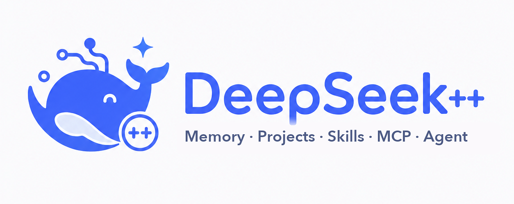

<p align="center">
  
</p>

<h1 align="center">DeepSeek++ GAL</h1>

<p align="center">
  <strong>DeepSeek web AI-agent workspace × GAL-tavern roleplay stage</strong>
</p>

<p align="center">
  <a href="https://github.com/wwwangzilin/deepseek-pp-gal/releases"></a>
  <a href="https://github.com/zhu1090093659/deepseek-pp"></a>
  <a href="../../blob/main/README.md">中文 README</a> ·
  <a href="#gal-tavern">GAL Tavern</a> ·
  <a href="#character-mode">Character Mode</a> ·
  <a href="#install">Install</a> ·
  <a href="#develop">Develop</a>
</p>

DeepSeek++ GAL is a derivative browser extension built on [DeepSeek++](https://github.com/zhu1090093659/deepseek-pp) (v1.14.0). It keeps the full AI-agent workspace — long-term memory, Skills, MCP, tools, automation — and adds a **GAL-tavern roleplay stage** on top of DeepSeek web, so you can chat with characters like playing a visual novel.

- **DeepSeek's original UI stays the default**; switch to the GAL stage one-click only when you want roleplay. Your choice is remembered.
- Desktop Chrome / Edge / Firefox.

## 🎭 GAL Tavern

Click **「🎭 GAL 酒馆」** at the bottom-right of `chat.deepseek.com` to enter the stage (click **「⏻ 关闭 GAL」** at the top-right to return to the original UI).

- **Character cards**: presets like "DeepSeek娘" and "雪璃"; each card can define portrait, accent color, description, personality, scenario, example dialogue, greeting and extra system instructions.
- **Mode picker**: before a new chat, pick a character to load its setup and memories in one click.
- **Typewriter & paging**: replies are typed out and long text is paged; thinking is shown separately, never mixed into the spoken lines.
- **Auto card saving**: tell the AI "you play XX…" and GAL detects the roleplay setup and offers to save it as a reusable mode.

## 🧠 Character Mode (memory follows the character)

Every character owns an **independent memory space**:

- Memories are either **global** (shared by all characters, e.g. general preferences) or **character-bound** (injected only while that character is active).
- While chatting with a character, memories the model auto-consolidates are **attributed to that character**; switching characters never leaks one character's memories into another.
- The **「🧠 记忆」** button in the character panel manages that character's memories: view, add, promote to global, delete.
- Switching characters opens a fresh conversation (session-level isolation) so previous context does not leak.

## ⚡ Inherited capabilities

All upstream DeepSeek++ v1.14.0 features (see the [upstream README](https://github.com/zhu1090093659/deepseek-pp)): agentic memory, Side Panel chat, Skills, native-style tools (web search / web fetch / Python & Shell sandbox / browser control), prompt presets, saved items, conversation export, MCP servers, scheduled automation, cloud sync (Google Drive / OneDrive / WebDAV), floating pet and themes.

> This fork targets GAL roleplay; Native-Host dependent capabilities (local file access, browser control) behave like upstream — install the matching host when needed.

## 📦 Install

**Option A: Release package (recommended)**

1. Download the zip for your browser from [Releases](https://github.com/wwwangzilin/deepseek-pp-gal/releases);
2. Unzip it to a local folder;
3. Open `chrome://extensions` (or `edge://extensions`) and enable **Developer mode**;
4. Click **Load unpacked** and pick the folder.

**Option B: build from source**

```bash
npm ci
npm run build:chrome      # output in dist/chrome-mv3
# or npm run dev          # dev mode with auto reload
```

Then load `dist/chrome-mv3` as an unpacked extension.

## 🛠 Develop

```bash
npm run compile            # type check
npm test                   # unit tests
npm run prompt:freeze      # prompt byte-freeze check
npm run ci:quality         # full quality gates
npm run build:all          # chrome + edge + firefox
npm run zip:chrome         # build the zip
```

Release flow: bump the version (`package.json` and `packages/shell-host/package.json` must match) → push → push a `v*.*.*` tag; GitHub Actions builds and publishes the Release automatically (this fork does not publish the upstream npm package).

## 📜 Version history

- **v1.15.0**: GAL-tavern stage + DSH-style character mode (character-scoped memory, auto attribution) + original-UI-default with one-click toggle. See [docs/releases/1.15.0.md](docs/releases/1.15.0.md).
- v1.14.0 and earlier: upstream DeepSeek++ history under [docs/releases/](docs/releases/).

## 🤝 Credits

- Upstream [DeepSeek++](https://github.com/zhu1090093659/deepseek-pp) (Apache-2.0): the whole agent workspace and engineering base
- [deepseek-gal-tavern](https://github.com/wwwangzilin/deepseek-gal-tavern): GAL stage interaction prototype
- Open-source community character art (bundled locally with the extension)

## License

Apache-2.0 (same as upstream). The GAL stage and character mode are fork additions, also Apache-2.0.
